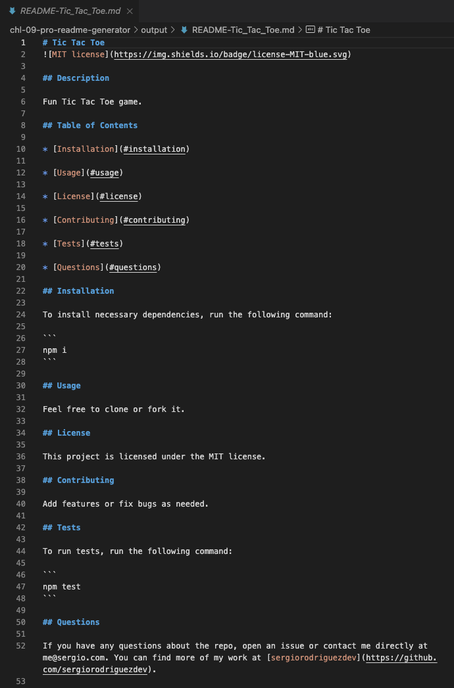

# Challenge 09 - Professional README Generator

## Project Description

When creating a project on GitHub, you should create a professional README to better engage potential users and contributors. Automating the creation of your README file will allow you to be more productive and focus more time on other aspects of your project. The README generator will guide you through a list of very simple questions, and your responses will be used to automatically create a README for you!

While working on this project, I had the opportunity to apply my knowledge of `npm` to install the necessary dependencies as well as learn [**Inquirer**](https://www.npmjs.com/package/inquirer) more in-depth. I initially built a very basic list of questions which I then expanded to include input validation for questions that require a response from the user. Additionally, I included a question that is only asked based on the response to another question; when the user is prompted to select a license, they are then asked to pick a color for the badge that will be generated only if they pick an option other than `None`.

I really enjoyed learning more about **Inquirer** and creating an app in JavaScript that isn't dependent on HTML or a browser to be executed.

## Table of Contents
- [User Story](#user-story)
- [Acceptance Criteria](#acceptance-criteria)
- [Links](#links)
- [Dependencies](#dependencies)
- [Usage](#usage)
- [Walkthrough](#walkthrough)
- [Screenshots](#screenshots)

## User Story

```
AS A developer
I WANT a README generator
SO THAT I can quickly create a professional README for a new project
```

## Acceptance Criteria

```
GIVEN a command-line application that accepts user input
WHEN I am prompted for information about my application repository
THEN a high-quality, professional README.md is generated with the title of my project and sections entitled Description, Table of Contents, Installation, Usage, License, Contributing, Tests, and Questions
WHEN I enter my project title
THEN this is displayed as the title of the README
WHEN I enter a description, installation instructions, usage information, contribution guidelines, and test instructions
THEN this information is added to the sections of the README entitled Description, Installation, Usage, Contributing, and Tests
WHEN I choose a license for my application from a list of options
THEN a badge for that license is added near the top of the README and a notice is added to the section of the README entitled License that explains which license the application is covered under
WHEN I enter my GitHub username
THEN this is added to the section of the README entitled Questions, with a link to my GitHub profile
WHEN I enter my email address
THEN this is added to the section of the README entitled Questions, with instructions on how to reach me with additional questions
WHEN I click on the links in the Table of Contents
THEN I am taken to the corresponding section of the README
```
 
## Links

To access the code repository, use the link below:

- ### GitHub Repository URL
    https://github.com/sergiorodriguezdev/chl-09-pro-readme-generator

## Dependencies

To install the appropriate dependencies ([**Inquirer v8.2.4**](https://www.npmjs.com/package/inquirer/v/8.2.4)), execute the following command from the repo folder:

```
npm install
```

Alternatively, if the `package.json` file is missing, execute the following commands from the repo folder:

```
npm init -y
npm i inquirer@8.2.4
```

## Usage

Clone or download the repo folder to your local machine and install the dependencies as specified in the [Dependencies](#dependencies) section. Then, launch the app using the following command:

```
node index.js
```

You will be asked a series of questions, some of which are required before proceering, and a README file will be generated automatically for you. To avoid overwriting existing README files, the generated READMEs will be saved to the `./output` sub directory and the file name will include your project name. For example, if your project is named "Scientific Calculator" then the path to the README will be `./output/README-Scientific_Calculator.md`.

## Walkthrough

Click [HERE](https://user-images.githubusercontent.com/119548442/233746593-3c241204-fea8-4da6-904d-cf23450a47a7.mp4) for a walkthrough of the app.

## Screenshots





